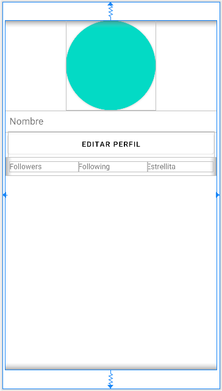
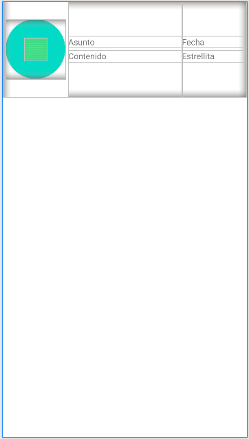
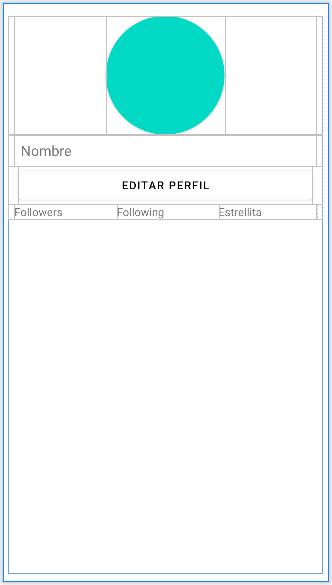
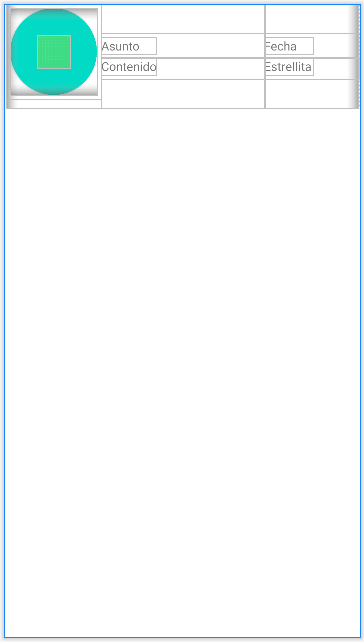
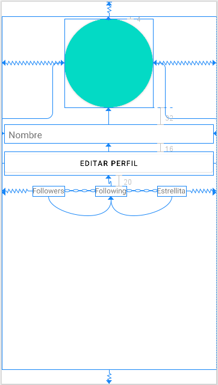
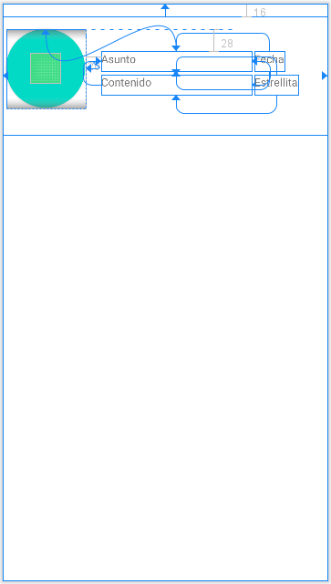
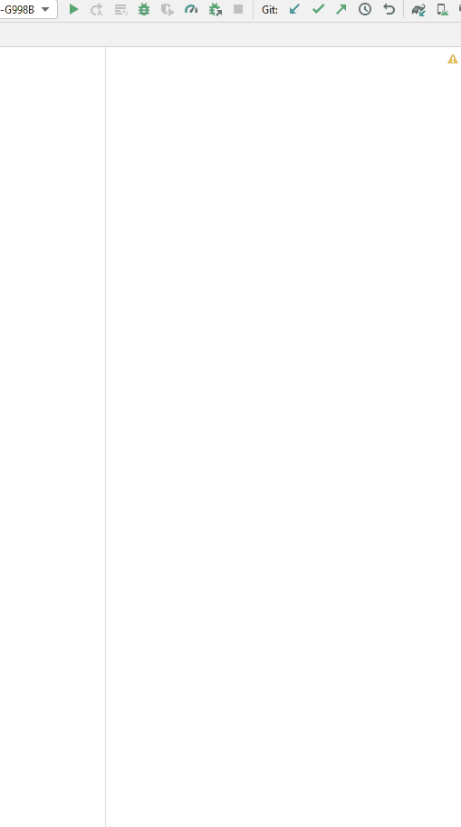

# Desarrollo de 6 Layouts

### [Link del código de la aplicación](https://github.com/raulop194/TooManyInterfaces-Task6)

## Requisitos
- Android Studio
- Cualquier emulador o simulador conectado por el pueto ADB ( Android Data Bridge )

## Comenzando

### Layout 1
En este la yout se ha utilizado un primer _LinearLayout_ orientado de manera __vertical__ que contiene todos los componentes del layout, y luego otro más para ordenar de manera __horizontal__ para contener 3 componentes _TextView_

### Layout 2
En este layout tenemos alineados 3 _LinearLayout_ verticales dentro de uno horizontal. En cada uno de los layouts el punto de gravedad esta puesto como center.

### Layout 3
En este otro tenemos un _TableLayout_ en la que cada _TableRow_ contiene un componente, exceptuamndo en la ultima fila que contiene 3 _TextView_.

### Layout 4
Ahora en este layout pasa algo peculiar, tenemos 3 _TableLayout_ contenidos en un _LinearLayout_ orientado en horizontal, ya que no es recomendable tener más de 1 columna en un _TableLayout_

### Layout 5
En el de a continuación utilizamos un _ConstrainLayout_ uniendo los punto como aparece en la imagen. El botón del layout tiene establecido que tenga el mismo ancho que al padre que esta unido; y los textos estan unido por cadenas para posicionarse de una manera dinámica.

### Layout 6
Ya por último en este layout se ha utilizado un _ConstrainLayout_ uniendo los punto como en la imagen

Como resultado nos deberia aparecer algo parecido a esto:

